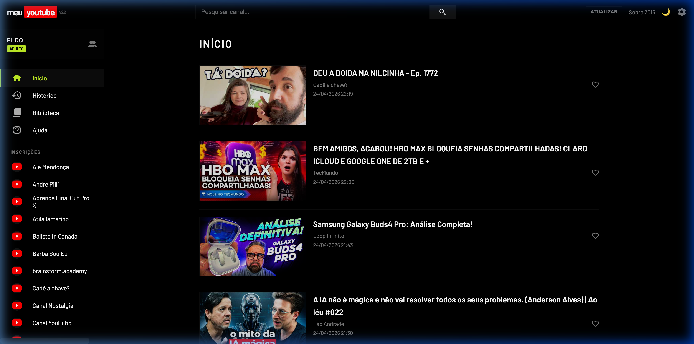

# meu **youtube** 🌑 v2.5.0
> O seu dock de monitoramento industrial ultra-rápido, livre de distrações e focado em alta performance.

## ⚙️ O que é este projeto?

O **meu-youtube** não é apenas mais um leitor de vídeos; é um **Monitor Tecnológico Industrial** feito para editores de vídeo, criadores e profissionais que precisam de referências sem o ruído do algoritmo do YouTube. 

Ele elimina anúncios, shorts e recomendações viciantes, entregando um feed puro, preto absoluto (OLED) e totalmente sob seu controle.

---

## 🚀 Novas Funcionalidades (v2.5.0)

### 🌓 Monitor de Edição (Auto-Refresh Pandora)
O dashboard conta com um **Auto-Refresh Assíncrono**. Uma linha de progresso finíssima no topo indica a próxima varredura de vídeos. Ele atualiza seu feed em segundo plano sem interromper o que você está assistindo no player.

### 👤 Gestão Multi-Perfil & Segurança
Agora a casa inteira pode usar! Implementamos uma gestão completa de perfis baseada em idade com persistência em PostgreSQL:
- **Adulto (18+)**: Acesso total, focado em monitoramento profissional.
- **Adolescente**: Filtros de conteúdo moderados.
- **Criança**: Filtro restritivo automático.

### 🎨 Estética Industrial OLED & Manifesto
Fundo em **#000000** real, tipografia **Barlow 900** e acentos em **Verde Limão**. O projeto inclui um **Manifesto Autoral** que explica a filosofia por trás da ferramenta.

---

## 🛠️ Como usar (Guia Rápido)

### 1. Traga seus inscritos (Google Takeout)
1. Vá ao **[Google Takeout](https://takeout.google.com/)**, marque apenas **YouTube** e selecione a pasta **subscriptions**.
2. Baixe o arquivo **`subscriptions.csv`**.
3. No dashboard, abra a **Engrenagem ⚙️** e faça o upload.

### 2. Configure seu Perfil
Ao entrar pela primeira vez, crie seu perfil. Você pode gerenciar vários usuários e alternar entre eles instantaneamente.

---

## 📦 Instalação e Deploy

**Deploy na Vercel (Recomendado)**:
Conecte este repositório e configure a variável de ambiente `POSTGRES_URL`.

**Rodando Localmente**:
1. Instale: `pip install -r requirements.txt`
2. Execute: `python app.py`

---

**Tecnologias**: Python (Flask), Vercel Postgres, AJAX SPA Architecture, OLED Industrial Design.
**Desenvolvido para Máxima Produtividade.** 🌑⚙️📈
